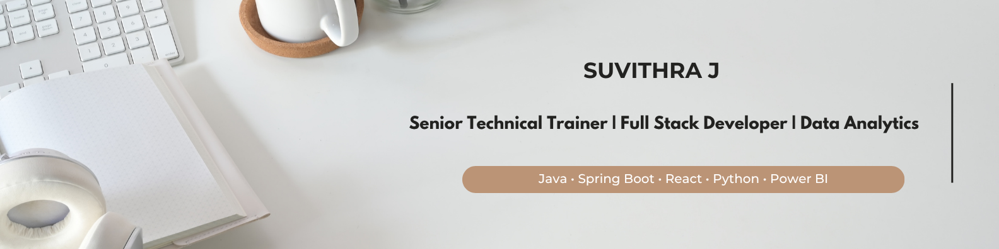

  

Empowering learners through practical training, hands-on projects, real-world application development, and career-focused mentoring with industry standards.

  

---

## 👩‍💻 About Me

- 🎓 Senior Technical Trainer with 5+ years of experience
- 💻 Full Stack Developer specializing in Java, Spring Boot, React, Python & Django
- 📊 Data Analytics enthusiast with Power BI expertise
- 👨‍🏫 Trained 2000+ learners through project-based learning
- 🚀 Passionate about bridging education and industry
- 🌱 Exploring Data Science, Cloud Technologies, and AI-Powered Solutions

---
## 🚀 Featured Projects

### 🏢 Smart Apartment Management System

#### Key Features
- Resident Management
- Visitor Tracking
- Complaint Management
- Parking Allocation System
- Online Payment Tracking
- JWT Authentication & Authorization
- PDF and Excel Report Generation

#### Tech Stack

**React.js • Spring Boot • MySQL • JWT • REST API**

🔗 Repository: [View Project](https://github.com/suvithra18/Smart-Apartment-Management-System)

---

### 🤖 CodeGenome AI Platform

#### Key Features
- Resume Analysis
- GitHub Profile Evaluation
- Coding Assessment Tracking
- Mock Interview Management
- Student Leaderboard
- Automated Performance Reports
- Skill Gap Analysis

#### Tech Stack

**React.js • Spring Boot • Python • MySQL • AI Integration**

🔗 Repository: [View Project](https://github.com/suvithra18/CodeGenome-AI-Platform)

---

### 📊 EmoHealth Analytics Dashboard

#### Key Features
- Healthcare Data Analysis
- Patient Risk Assessment
- Forecasting Models
- Interactive KPI Dashboard
- DAX Calculations
- Trend Analysis
- Executive Reporting

#### Tech Stack

**Power BI • DAX • Excel • Data Analytics**

🔗 Repository: [View Project](https://github.com/suvithra18/Power-BI-EmoHealth_Analytics)

---

### 💰 Revenue Leakage Analytics Dashboard

#### Key Features
- Revenue Loss Identification
- KPI Monitoring
- Department Performance Analysis
- Trend Visualization
- Business Insights Reporting
- Interactive Filters

#### Tech Stack

**Power BI • DAX • Excel • Business Intelligence**

🔗 Repository: [View Project](https://github.com/suvithra18/Power-BI-Revenue-Leakage-Project)

---

### 📈 Process Pulse Dashboard

#### Key Features
- Workflow Performance Tracking
- SLA Monitoring
- Process Bottleneck Detection
- Resource Utilization Analysis
- Executive Dashboard Reporting

#### Tech Stack

**Power BI • DAX • Excel**

🔗 Repository: [View Project](https://github.com/suvithra18/Power-BI-Process-Pulse)

---

## 🛠️ Tech Stack

### Frontend
<table align="center">
<tr>
<td align="center" width="120">
 
HTML5
</td>

<td align="center" width="120">
 
CSS3
</td>

<td align="center" width="120">
 
JavaScript
</td>

<td align="center" width="120">
 
React.js
</td>

<td align="center" width="120">
 
Bootstrap
</td>
</tr>
</table>

### Backend

<table align="center">
<tr>
<td align="center" width="120">
 
Java
</td>

<td align="center" width="120">
 
Spring Boot
</td>

<td align="center" width="120">
 
Python
</td>

<td align="center" width="120">
 
Django
</td>

</tr>
</table>

### Database

<table align="center">
<tr>
<td align="center" width="120">
 
MySQL
</td>

<td align="center" width="120">
 
PostgreSQL
</td>

<td align="center" width="120">
 
SQLite
</td>

</tr>
</table>

### Data Analytics

<table align="center">
<tr>
<td align="center" width="120">
 
Power BI
</td>

<td align="center" width="120">
 
Excel
</td>

<td align="center" width="120">
<strong>DAX</strong> 
Data Analysis Expressions
</td></tr>
</table>

### Tools

<table align="center">
<tr>
<td align="center" width="120">
 
Git
</td>

<td align="center" width="120">
 
GitHub
</td>

<td align="center" width="120">
 
VS Code
</td>

<td align="center" width="180">
 
Postman
</td>

</tr>
</table>

---

## 💼 Professional Highlights

- 🎯 Trained 2000+ learners across Full Stack Development and Programming
- 📚 Designed and delivered industry-oriented technical curricula
- 🏆 Conducted 15+ technical workshops, bootcamps, and hackathons
- 💼 Mentored students for internships, placements, and career growth
- 🚀 Built project-based learning programs aligned with industry requirements
    
---

## 📜 Certifications

- 🏆 Data Analytics – NoviTech R&D Pvt Ltd
- 🏆 Data Analytics – Nexila Technologies
- 🏆 MySQL – Great Learning

---

## 🌐 Connect With Me

- 💼 LinkedIn: [linkedin.com/in/suvithraj](https://linkedin.com/in/suvithraj)
- 🌐 Portfolio: [Portfolio Website](https://suvithra18.github.io/portfolio)
- 📧 Email: suvithrachithra@gmail.com
- 🐙 GitHub: [github.com/suvithra18](https://github.com/suvithra18)

---

## 🤝 Let's Connect

💡 Open to opportunities in Technical Training, Full Stack Development, and Data Analytics.

🚀 Passionate about mentoring, software development, and data-driven solutions.

📫 Feel free to connect for collaboration, training, or professional opportunities.
